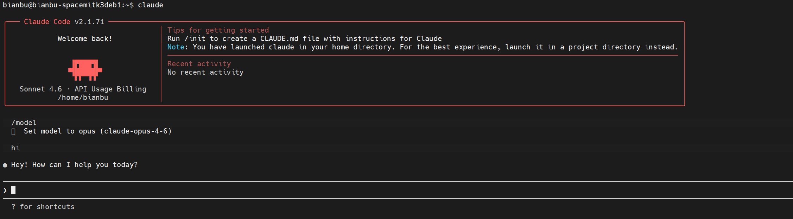

# Claude Code

**Claude Code** 是一个用于智能体编程的命令行工具,由 Anthropic 开发。它允许开发者通过命令行界面与 Claude AI 进行交互,实现代码生成、调试、重构等智能编程辅助功能。

## 安装

### 安装 npm

```shell
sudo apt install npm
```

### 安装 Claude Code

```shell
sudo npm i --registry=http://nexus.bianbu.xyz/repository/npmproxy/ -g @anthropic-ai/claude-code
```

验证安装:

```shell
claude --version
```

## 配置

### 设置环境变量

**注意**: 创建 API Token 时,需要在分组选择中选择 **claude** 分组。

```shell
cat >> ~/.bashrc << 'EOF'
export ANTHROPIC_BASE_URL="供应商URL"
export ANTHROPIC_AUTH_TOKEN="生成的API_KEY"
EOF
source ~/.bashrc
```

### 配置 API Key 自动批准

```shell
(cat ~/.claude.json 2>/dev/null || echo 'null') | jq --arg key "${ANTHROPIC_API_KEY: -20}" '(. // {}) | .customApiKeyResponses.approved |= ([.[]?, $key] | unique)' > ~/.claude.json.tmp && mv ~/.claude.json.tmp ~/.claude.json
```

## 使用

启动 Claude Code 交互式会话:

```shell
claude
```

切换模型以及使用:



在交互式会话中,您可以:
- 询问编程问题
- 请求代码生成和优化
- 进行代码调试和重构
- 获取技术建议和最佳实践

输入 `/exit` 退出会话。
