# 知了（zenow）

**知了（zenow）** 是一款运行于本地的 AI 知识助手桌面应用，基于 Electron + React + FastAPI 构建，通过 llama-server 在本地运行 GGUF 格式的大语言模型，支持多模型并行管理、知识库问答等功能，保护用户数据隐私。

## 平台支持情况

| 平台&系统     | 是否支持加速 |
|----------|------------|
| K1 Bianbu LXQT/GNOME       | 不支持        |
| K1 Buildroot   | 不支持 |
| K1 OpenHarmony5.0 | 不支持 |
| K3 Bianbu LXQT/GNOME      | 支持        |
| K3 Buildroot   | 不支持 |

## 技术栈

应用了哪些技术点
例：
LLM SDK (链接)
SPEECH SDK （链接）
...

## 框架图

一张漂亮的展示应用框架结构的图

## 安装
同事安装llm-sdk和sm-sdk，是为了保证这两个依赖包也更新到最新。
```bash
sudo apt update
sudo apt install zenow llm-sdk sm-sdk
```

## 使用

### 启动

点击左下角 Windows 菜单，搜索 **zenow** 或 **知了** 即可找到并启动应用。

> 💡 可右键应用图标，选择"添加到桌面"，并信任它，方便下次快速启动。


### 下载模型

进入**设置页面**，点击模型列表，选择所需模型即可开始下载。


支持同时点击多个模型并发下载。

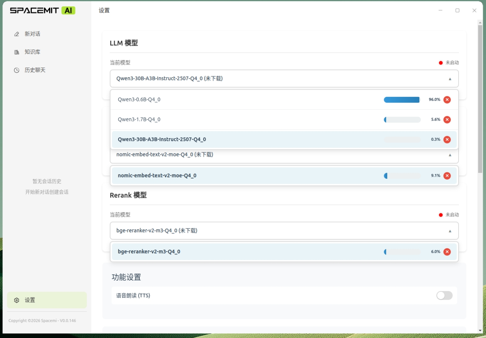


### 启用模型

下载完成后，再次点击已下载的模型，等待状态灯由红色变为绿色（提示"模型启动成功"），即可开始使用。

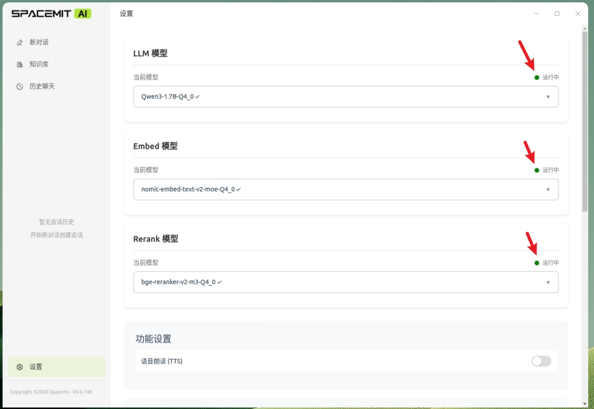


> 为保障知识库功能的完整性，建议至少各下载并启动一个 **LLM**、**Embed**、**Rerank** 模型。

启动成功后即可使用**新对话**和**知识库**等功能。

### 直接聊天

点击左侧选择栏的“新对话”, 选择已下载的模型并等待其状态等变成绿灯，此时可以正常问答，比如在输入栏中输入“写一首诗”，并使用回车键发送，或者点击发送按钮,就可以在聊天框看到模型流式输出回答内容。
可以发现此时会自动创建一个对话，并进入该会话中，知了支持多轮对话功能，可以保持之前的会话记忆进行对话。
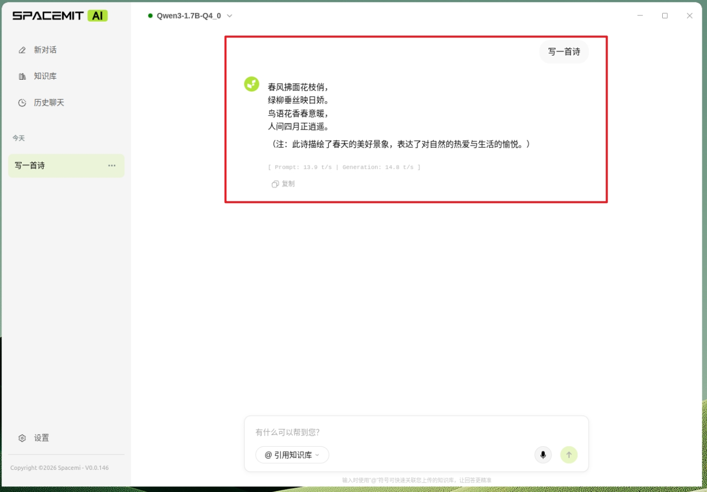


### 知识库导入
点击左侧选择栏的“知识库”, 接着新建知识库，知识库名称可以自己选择，然后可以写简介以及点击头像来换头像。

创建完知识库后，此时知识库还没有东西，要添加资料。

点击进入你要添加资料的知识库。

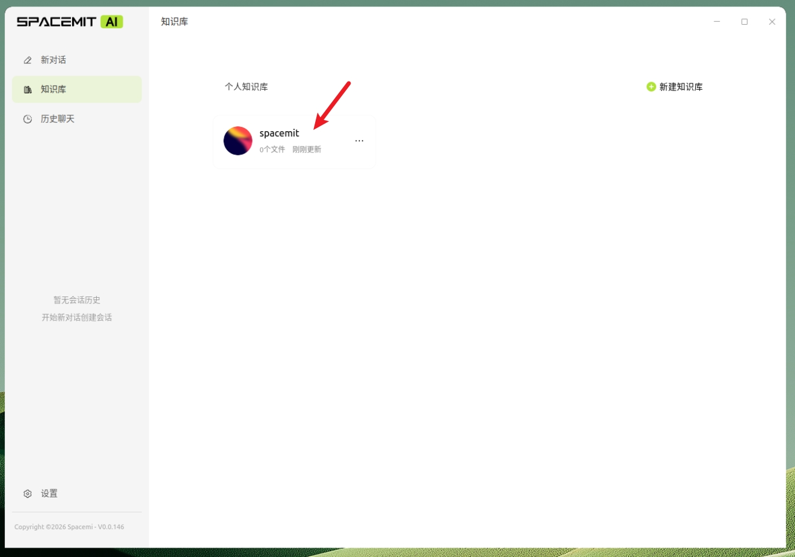
添加你需要上传的文档，可以按住ctrl进行选择，可以一次选择多个文件进行上传。


按如下步骤，选择文件后上传。
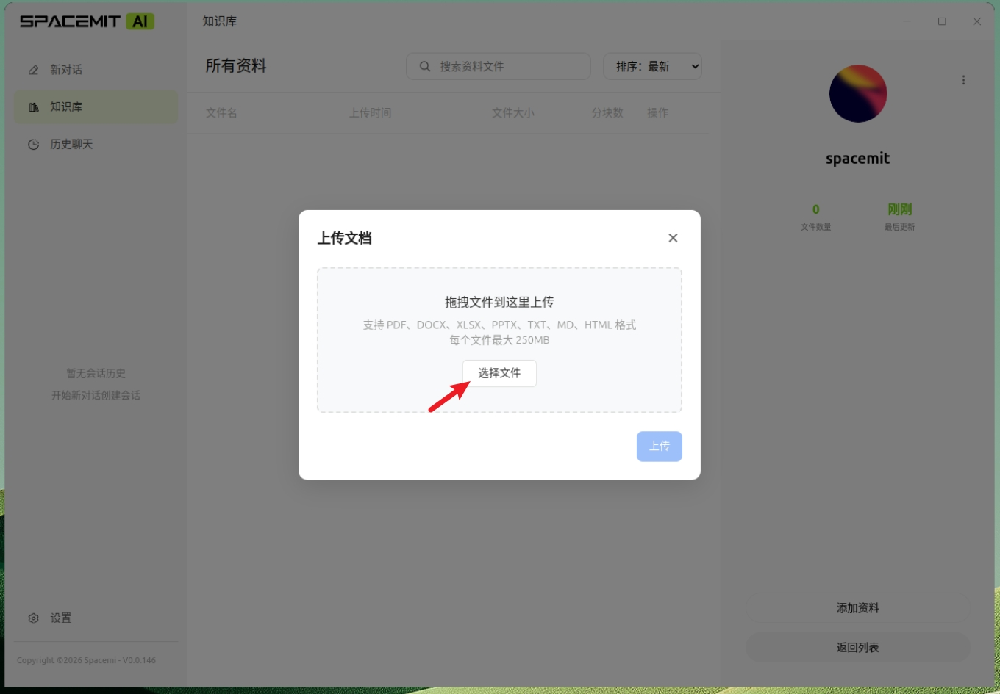


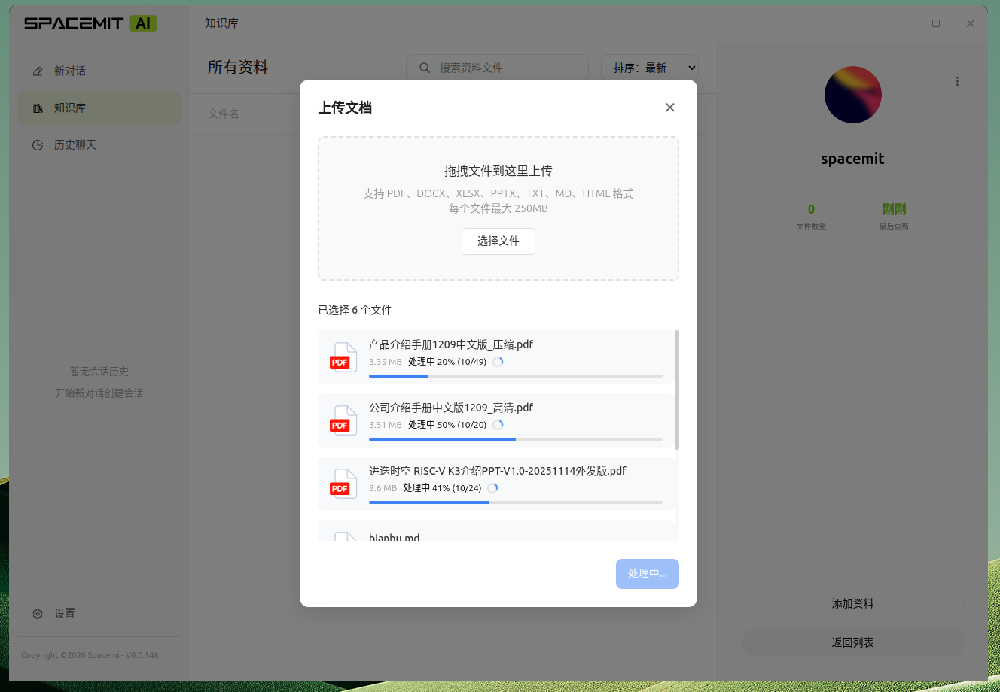

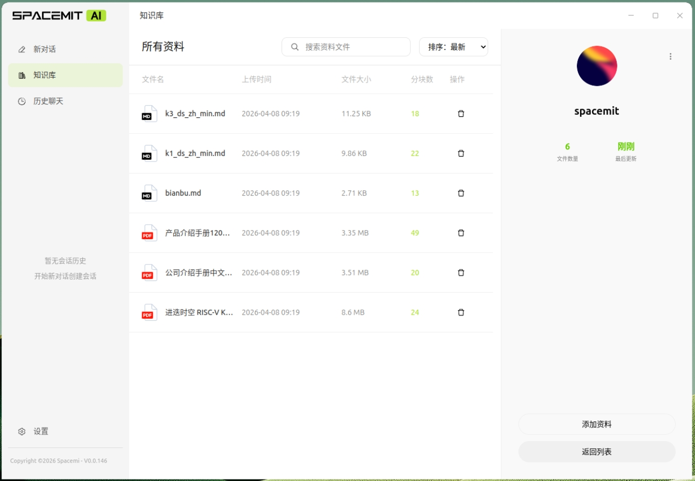


### 基于知识库聊天
可以选择新对话，或者基于之前的聊天历史继续对话。这里我选择之前的聊天历史继续对话。
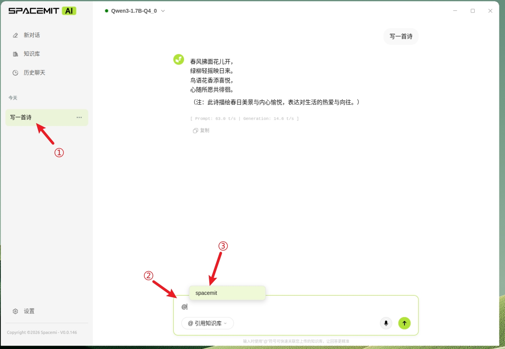
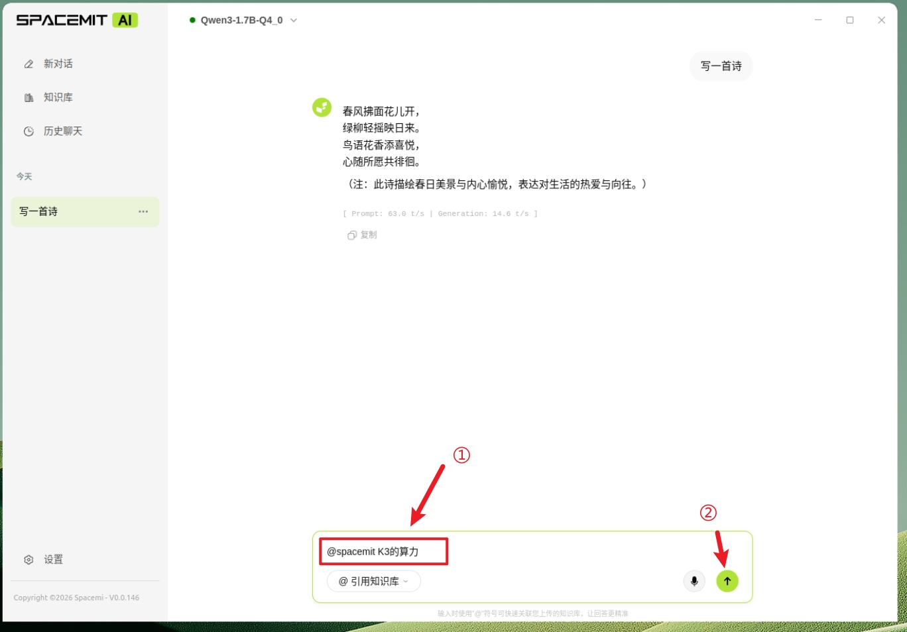


### 语音输入输出
在保证连接了麦克风的情况下，可以呼叫“小迭小迭”，来唤醒语音输入。或者直接点击语音按钮来启动语音输入模式。

语音球被唤醒，代表此时接受语音输入。当检测到用户停止说话持续3秒后，会自动发送用户的语音输入内容，并关闭语音输入模式。
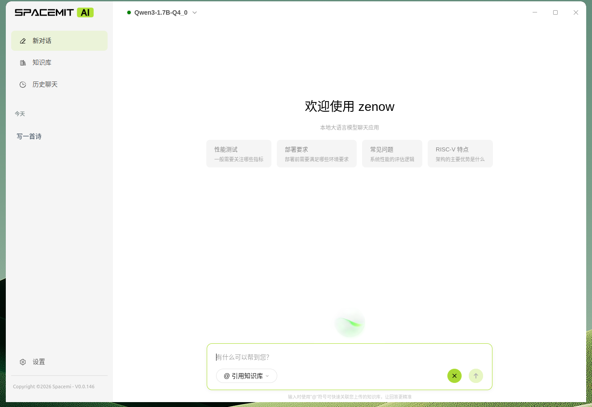
可以在设置界面，点击启动语音朗读功能。默认为关闭状态。启动后，即可让AI回复的时候包含语音回复。
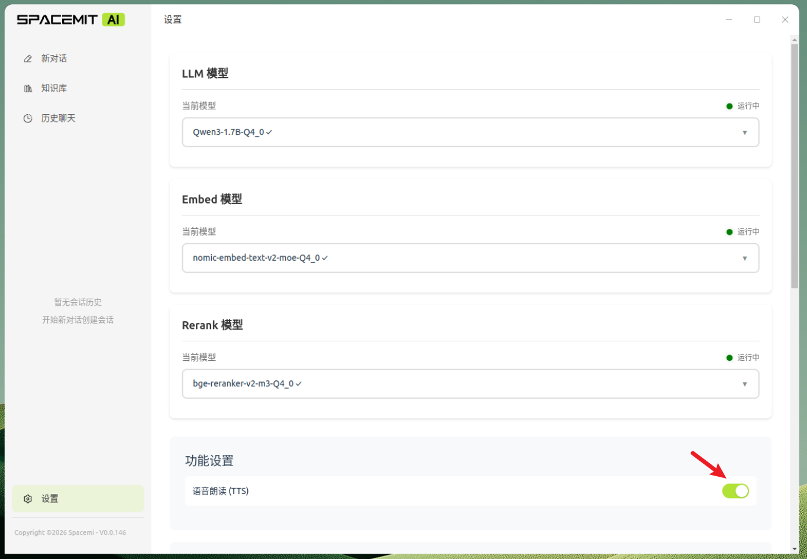

### 设置参数说明
LLM服务器参数包含上下文窗口，CPU线程数，GPU层数，批处理大小
客户端参数包含采样温度，重复惩罚，最大生成Token数

Embed服务器参数包含上下文窗口，CPU线程数，GPU层数，批处理大小
客户端参数包含归一化向量，是否截断过长文本
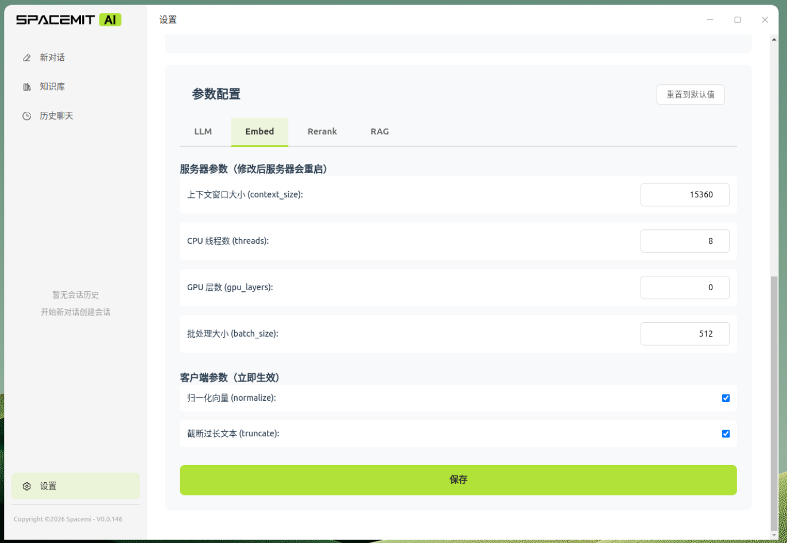
Rerank服务器参数包含上下文窗口，CPU线程数，GPU层数，批处理大小
客户端参数包含返回前N个结果，是否返回文档内容

RAG服务器参数 检索参数                                                                              
           
  top_k（最终返回数量）                                                                 
  - 最终返回给 LLM 的文档片段数量                                                     
  - 经过所有检索和重排序后，实际使用的结果数
  - 范围：1-20

  initial_k（初始检索数量）
  - 第一阶段检索时获取的候选文档数量
  - 用于向量搜索和 BM25 关键词搜索
  - 范围：10-200
  - 越大召回率越高，但计算成本也越高

  intermediate_k（中间结果数量）
  - 经过 RRF（Reciprocal Rank Fusion）融合后保留的文档数
  - 在重排序（rerank）之前的候选集大小                                                  
  - 范围：5-50
  - 介于 initial_k 和 top_k 之间                                                        
                                                                                      
  embed_weight（向量权重）
  - 向量搜索在混合检索中的权重
  - 范围：0-1，步长 0.1
  - 与 bm25_weight 配合使用，控制语义相似度的重要性

  bm25_weight（关键词权重）
  - BM25 关键词搜索在混合检索中的权重
  - 范围：0-1，步长 0.1
  - 控制精确关键词匹配的重要性
  - 通常 embed_weight + bm25_weight 应该合理分配（不一定等于 1）

  检索流程

  这些参数在两阶段检索中的作用：

  1. 第一阶段：向量搜索和 BM25 各检索 initial_k 个结果
  2. 融合阶段：使用 RRF 算法融合两种结果，保留 intermediate_k 个
  3. 重排序阶段：使用 rerank 模型对 intermediate_k 个结果重新排序
  4. 最终输出：返回 top top_k 个结果给LLM                                              
                                                                                        
  权重参数影响 RRF 融合时的得分计算。      
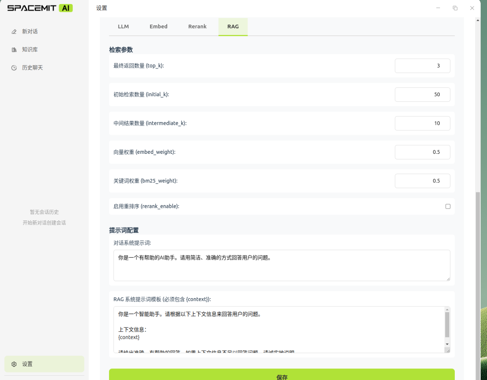


提示词配置                                                                            
                  
  conversation_system_prompt（对话系统提示词）                                          
  - 用于普通对话模式的系统提示词
  - 定义 LLM 的角色、行为和回答风格
  - 当用户不使用 @知识库 时生效    
  - 例如："你是一个有帮助的AI助手，请用简洁专业的语言回答问题"                          
                                                                                        
  rag_system_prompt_template（RAG 系统提示词模板）                                      
  - 用于 RAG 模式的系统提示词模板                                                       
  - 必须包含 {context} 占位符                                                           
  - 当用户使用 @知识库 提及时生效
  - {context} 会被替换为从知识库检索到的相关文档内容


## 性能


# 📊 Zenow 性能基准测试报告

> 生成时间：2026-04-03 17:17:34

---

## 知识库向量化

| 项目 | 值 |
| --- | --- |
| 文件 | `sample.txt` (4.2 KB) |
| 知识库 ID | 26 |
| Chunk 数量 | 5 |
| 上传耗时 | 55 ms |
| 向量化耗时 | 2364 ms |
| 总耗时 | 2419 ms |
| 平均每 chunk | 473 ms |
| 状态 | completed |

---

## 模型：Qwen3-0.6B-Q4_0

### ▶ 场景一：普通问答  (5/5 成功)

| 指标 | 值 |
| --- | --- |
| 平均 TTFT | 239 ms |
| 平均总耗时 | 2355 ms |
| 平均生成速度 | 35.2 t/s |
| 平均 token 数 | 72 tokens |

### ▶ 场景二：多轮对话  (5 轮 × 1 次重复)

| 轮次 | TTFT (ms) | 总耗时 (ms) | 生成速度 (t/s) | Token 数 |
| :--: | --: | --: | --: | --: |
| 1 | 170 | 569 | 38.8 | 14 |
| 2 | 342 | 812 | 37.4 | 16 |
| 3 | 365 | 2286 | 33.6 | 63 |
| 4 | 565 | 2999 | 31.0 | 74 |
| 5 | 650 | 2354 | 29.0 | 47 |

### ▶ 场景三：知识库问答  (5/5 成功)

| 指标 | 值 |
| --- | --- |
| 平均 TTFT（含检索） | 5118 ms |
| 平均总耗时 | 17314 ms |
| 平均生成速度 | 19.3 t/s |
| 平均 token 数 | 231 tokens |
| 平均命中 chunk 数 | 3.0 |

---

## 模型：Qwen3-1.7B-Q4_0

### ▶ 场景一：普通问答  (5/5 成功)

| 指标 | 值 |
| --- | --- |
| 平均 TTFT | 455 ms |
| 平均总耗时 | 19365 ms |
| 平均生成速度 | 15.6 t/s |
| 平均 token 数 | 281 tokens |

### ▶ 场景二：多轮对话  (5 轮 × 1 次重复)

| 轮次 | TTFT (ms) | 总耗时 (ms) | 生成速度 (t/s) | Token 数 |
| :--: | --: | --: | --: | --: |
| 1 | 254 | 3119 | 16.6 | 46 |
| 2 | 1107 | 4037 | 16.2 | 46 |
| 3 | 1138 | 22563 | 14.9 | 301 |
| 4 | 2965 | 30945 | 13.1 | 341 |
| 5 | 4128 | 15247 | 12.1 | 132 |

### ▶ 场景三：知识库问答  (5/5 成功)

| 指标 | 值 |
| --- | --- |
| 平均 TTFT（含检索） | 8328 ms |
| 平均总耗时 | 57517 ms |
| 平均生成速度 | 11.4 t/s |
| 平均 token 数 | 530 tokens |
| 平均命中 chunk 数 | 3.0 |

---

## 模型：Qwen3-30B-A3B-Instruct-2507-Q4_0

### ▶ 场景一：普通问答  (5/5 成功)

| 指标 | 值 |
| --- | --- |
| 平均 TTFT | 747 ms |
| 平均总耗时 | 62338 ms |
| 平均生成速度 | 8.8 t/s |
| 平均 token 数 | 490 tokens |

### ▶ 场景二：多轮对话  (5 轮 × 1 次重复)

| 轮次 | TTFT (ms) | 总耗时 (ms) | 生成速度 (t/s) | Token 数 |
| :--: | --: | --: | --: | --: |
| 1 | 483 | 6852 | 9.9 | 62 |
| 2 | 714 | 7101 | 9.6 | 60 |
| 3 | 773 | 56768 | 8.2 | 425 |
| 4 | 1253 | 91724 | 6.2 | 532 |
| 5 | 2215 | 57670 | 5.2 | 273 |

### ▶ 场景三：知识库问答  (5/5 成功)

| 指标 | 值 |
| --- | --- |
| 平均 TTFT（含检索） | 28623 ms |
| 平均总耗时 | 165871 ms |
| 平均生成速度 | 5.4 t/s |
| 平均 token 数 | 677 tokens |
| 平均命中 chunk 数 | 3.0 |

---

*由 Zenow Benchmark 自动生成*

